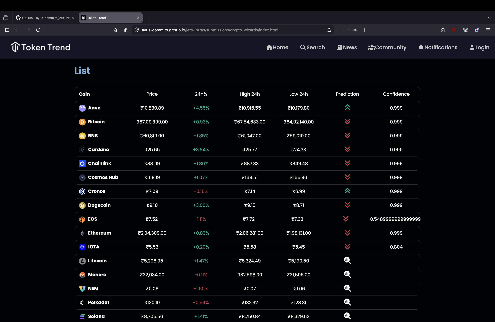

# Team Name: ...

## Team Members
* Member 1: [Ishani Kharche] - [https://github.com/Ishani-26]
* Member 2: [Pranjal Kumar Singh] - [https://github.com/pranjal1247]
* Member 3: [Kaustubh Bobade] - [https://github.com/kaustubhbobade29525-cpu]
* Member 4: [Ayush Malik] - [https://github.com/ayus-commits]
* Member 5: [Ananya Jain] - [https://github.com/ananyajain0028]

## 🔗 Project Links
* **PPT link:** [add link for ppt explaining your solution]
* **Hosted Demo:** [https://ayus-commits.github.io/jets-intras/submissions/crypto_wizards/index.html]

## Technical Implementation

### 1. Data Pipeline & Feature Engineering
The data pipeline is built using Python with libraries like pandas and numpy to process historical cryptocurrency datasets stored as CSV files. Each dataset is first cleaned by converting date columns into proper datetime format and removing missing or invalid values.

Several meaningful financial features are engineered to capture market behavior:
	Daily Returns to measure percentage change in price
	7-day Moving Average (MA₇) to smooth short-term fluctuations
    7-day Volatility (standard deviation of returns) to capture risk
    High-Low Range to represent intraday price spread

The target variable is defined as a binary classification:
    1 → price goes UP next day
    0 → price goes DOWN

The dataset is then split into training and testing sets (without shuffling to preserve time-series nature), and feature scaling is applied using StandardScaler to normalize input features.

### 2. The Machine Learning Engine
The machine learning engine is implemented using Logistic Regression, chosen for its simplicity, interpretability, and efficiency for binary classification tasks.

The model is trained on engineered features to predict the next-day price direction (UP/DOWN). Performance is evaluated using:
	•	Accuracy score
	•	Confusion matrix

A key optimization in this project is transforming the trained model into a frontend-friendly format:
	•	Model weights and bias are extracted
	•	Adjusted to remove dependency on scaling (StandardScaler)
	•	Exported as JSON files

This allows the model to run directly in the browser without requiring a backend server, making the system lightweight and fast.

### 3. Interactive Web Dashboard & Inference
The frontend is built using vanilla HTML, CSS, and JavaScript, providing a clean and responsive interface.

Key features include:
	•	Integration with the CoinGecko API to fetch real-time crypto market data
	•	Dynamic loading of pre-trained model weights (model.json)
	•	Client-side inference using JavaScript

When the app loads:
	1.	Model weights are loaded into memory
	2.	Live market data is fetched
	3.	Features are computed in the browser
	4.	Prediction is made using the logistic regression equation

This enables real-time AI-powered UP/DOWN predictions directly in the browser, eliminating the need for server-side computation and ensuring low latency.

##  Setup Instructions
1. Clone the Repository
    git clone https://github.com/ayus-commits/jets-intras.git
    cd jets-intras/submissions/crypto_wizards
2. Install Python Dependencies (for training the model)
    pip install pandas numpy scikit-learn
3. Train the Model (Optional)
    If you want to retrain the model or generate new weights:
    python ml_model/model.py
3. Run the Frontend
    Simply open the project in a browser:
    open index.html

##  Screenshots
* 
* 
* 